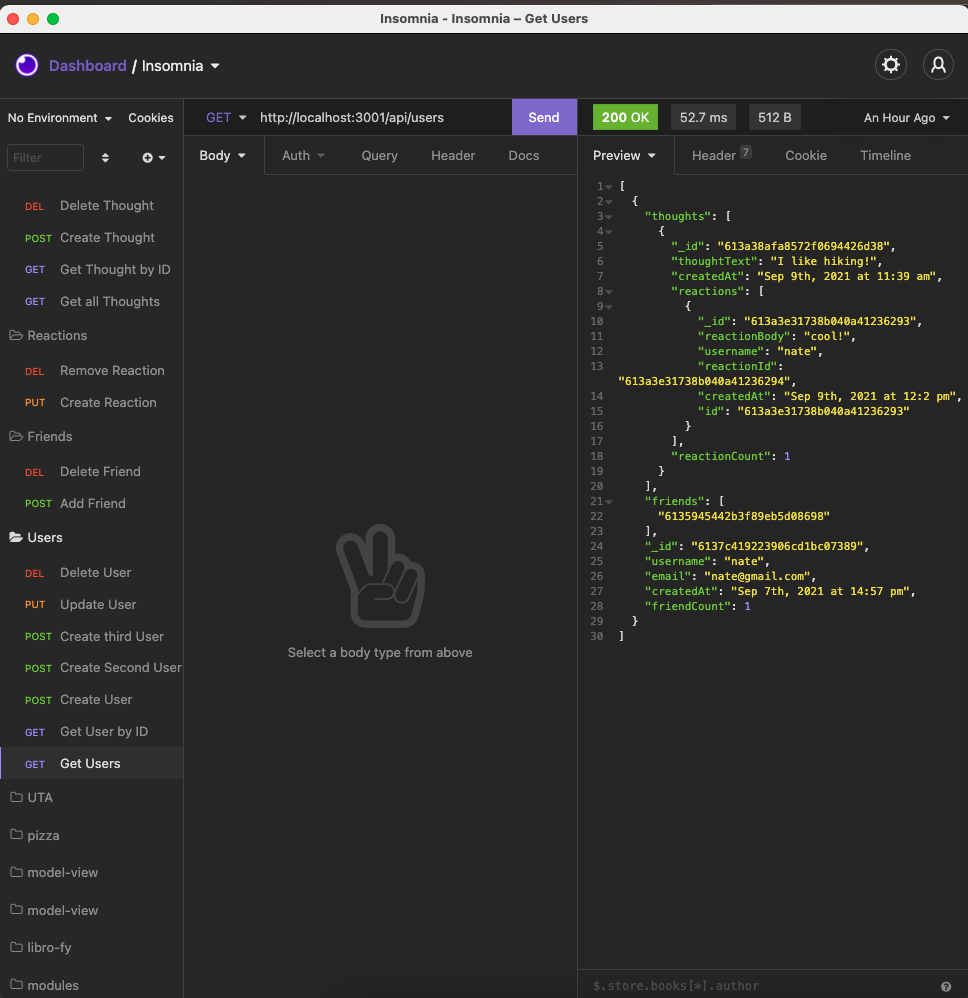

# social-network
## Description 
Social Network is a application built with an API. This application allows a user to create a friend's list, share thoughts and react to eachother's thoughts. The techonologies used are: Express,js is being utilized for routing. MondoDB database and Mongoose ODM and JavaScript to format the data stamps on each post. 




### Full Movie
Seperated into two videos:
[movie](https://drive.google.com/file/d/1uglwYMsT0YC4HUGdtLoBamd28HreCoYL/view)
[movie](https://drive.google.com/file/d/1K2I-wETeKJdWRPqvbElHHOc8kxMCDiaw/view)
## User Story

```
AS A social media startup
I WANT an API for my social network that uses a NoSQL database
SO THAT my website can handle large amounts of unstructured data
```

## Acceptance Criteria

```
GIVEN a social network API
WHEN I enter the command to invoke the application
THEN my server is started and the Mongoose models are synced to the MongoDB database
WHEN I open API GET routes in Insomnia Core for users and thoughts
THEN the data for each of these routes is displayed in a formatted JSON
WHEN I test API POST, PUT, and DELETE routes in Insomnia Core
THEN I am able to successfully create, update, and delete users and thoughts in my database
WHEN I test API POST and DELETE routes in Insomnia Core
THEN I am able to successfully create and delete reactions to thoughts and add and remove friends to a user’s friend list
```


## Table of Contents (Optional)


* [Installation](#installation)
* [Usage](#usage)
* [Credits](#credits)
* [License](#license)


## Installation


## Usage 


---

🏆 
## Badges


## Contributing / Credits

[mariamv29](https://github.com/mariamv29/README-generator.git)